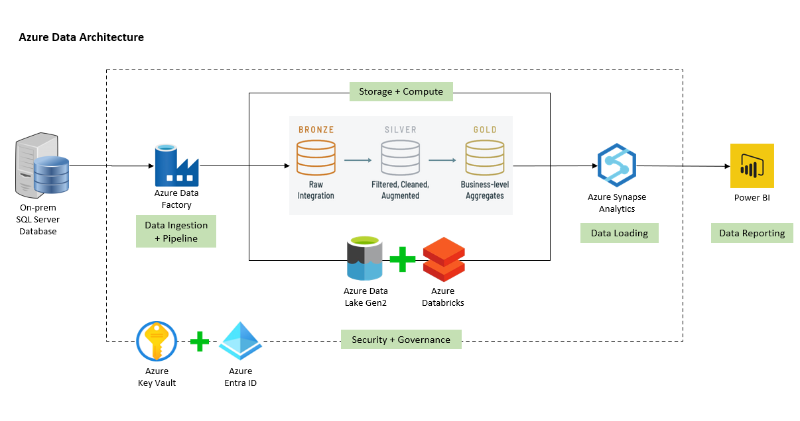

# db-migration-azure-data

## 📘 Project Overview

This project demonstrates an end-to-end data engineering pipeline for migrating an on-premises SQL Server database to the Azure Cloud. It covers data ingestion, transformation, storage, and reporting using key Azure services and Power BI.

---

## 🚀 Key Features

1. **Database Migration**  
   Transfer data from on-premises SQL Server to the Azure environment.

2. **Data Ingestion with Azure Data Factory**  
   Build pipelines to move data into **Azure Data Lake Storage Gen2**.

3. **Data Transformation using Azure Databricks**  
   Clean and process data using PySpark notebooks, store refined data in curated zones.

4. **Data Loading into Azure Synapse**  
   Load processed data into **Azure Synapse Analytics** for querying and reporting.

5. **Interactive Reporting with Power BI**  
   Create dashboards to display key business insights and metrics.

---

## 🖼️ Architecture Diagram

---

## ✅ Prerequisites

- Working knowledge of **SQL** and **Python**
- Familiarity with the following **Azure services**:
  - Azure Data Factory
  - Azure Data Lake Storage Gen2
  - Azure Databricks
  - Azure Synapse Analytics
  - Azure Key Vault
  - Power BI

---